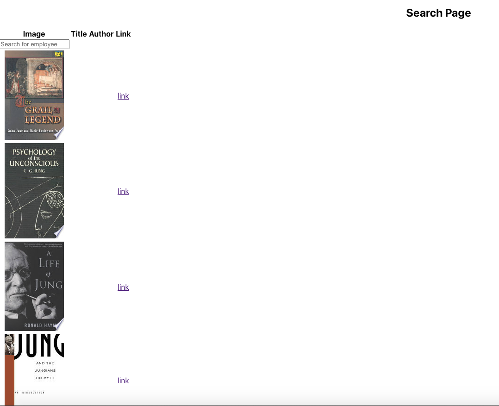

# hw-06-weather-dashboard

## Description

A react based Google Books Search app. The app allows the user to search for books from the google image search API.

## Table of Contents

- Installation
- Usage
- License
- Contributors
- Tests
- Questions

## Installation

View the app on your local machine or on Heroku here : https://damp-cove-73172.herokuapp.com/

## Usage

Enter a book name or author in the search bar in order to get results for the book. Click the link to get additional details on the book.

## Licenses

MIT License

## Contributors

Ali Khan

## Tests

Tested on Local Host and Heroku

## Questions

email Ali.Khan4990@gmail.com

